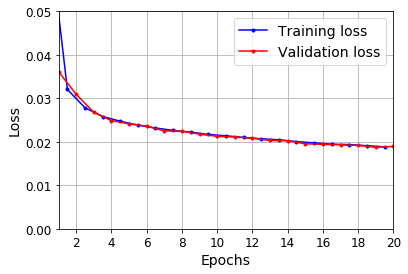
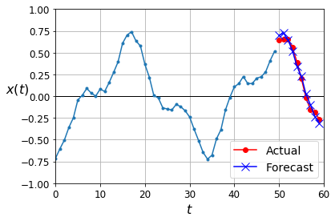

# My notes on some books I read on Machine Learning

Ongoing process...

- Hands-on Machine Learning with Scikit-Learn, Keras and TensorFlow - Aurélien Geron [[open notes]](hands-on-ml/notes.md)

- Python Machine Learning - Sebastian Rashcka [[open notes]](python-ml/notes.md)

# Applications

## WaveNet

From van den Oord's [paper](https://arxiv.org/abs/1609.03499)

### Forecast Example

