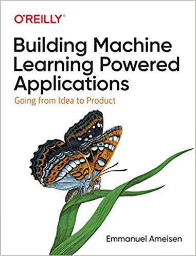

# Building Machine Learning Powered Applications: Going from Idea to Product

Author: Emmanuel Ameisen

# Part I. Find the Correct ML Approach

# Ch1. From Product Goal to ML Framing

> ML is particularly useful to build systems for which we are unable to define a heuristic solution

Start from a concrete business problem, determine whether it requires ML, then work on finding the ML approach that will allow you to iterate as rapidly as possible

1. Framing your product goal in an ML paradigm
2. Evaluating the feasibility of that ML task

Estimating the challenge of data acquisition ahead of time is crucial in order to succeed

## Data availability scenarios
- Labeled data exists
- Weakly labeled data exists
- Unlabeled data exists
- We need to acquire data

> "Having an imperfect dataset is entirely fine and shouldn’t stop you. The ML process is iterative in nature, so starting with a dataset and getting some initial results is the best way forward, regardless of the data quality."

## The Simplest Approach: being the algorithm
Start with a human heuristic and then build a simple model: initial baseline = first step toward a solution -> Great way to inform what to build next

## What to focus on in an ML project
Find the *impact bottleneck*: piece of the pipeline that could provide the most value if improved

Imagine that the impact bottleneck is solved: it was worth the effort you estimate it would take?

## Which modeling techniques to use
Spend the manual effort to look at inputs and outputs of your model: see if anything looks weird. Looking at your data helps you think of good heuristics, models and ways to reframe the product

