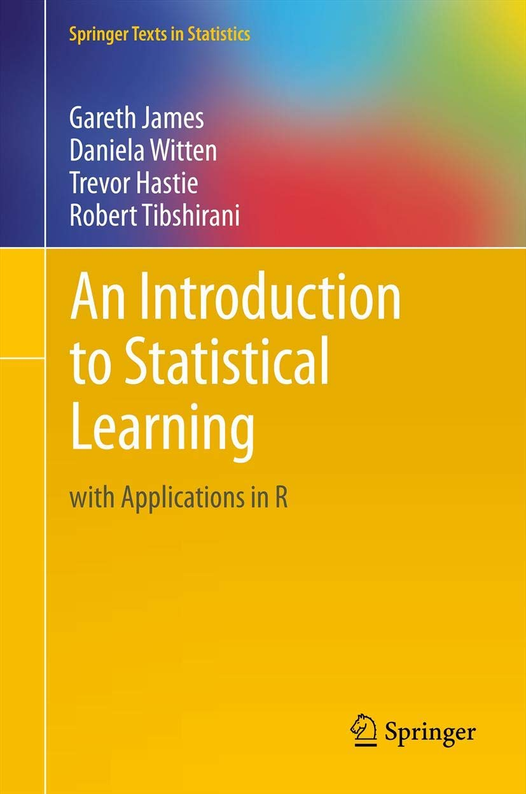

# An Introduction to Statistical Learning

Authors: Gareth M. James, Daniela Witten, Trevor Hastie, Robert Tibshirani

[Available here](https://link.springer.com/book/10.1007/978-1-4614-7138-7)

# Ch1. Introduction
- **Statistical learning**: vast set of tools for understanding data
- **Supervised**: building a statistical model for predicting, or estimating, an output based on one or more inputs
- **Unsupervised**: there are inputs, but no supervising output -> learn relationships and structure from data
- **Regression**: predicting a continuous or quantitative output value
- **Classification**: predicting a non-numerical value (categorical or qualitative output)
- **Clustering**: situations in which we only observe input variables, with no corresponding output

# Ch2. Statistical Learning

- Inputs: predictors, independent variables, features, variables, X
- Output: response, dependent variable, Y

Y = f(X) + e

Statistical learning refers to a set of approaches for estimating `f`

## Why estimate `f`?
Two reasons: *prediction* and *inference*

### Prediction
Accuracy depends on two quantities:
- Reducible error: we can potentially improve the accuracy of `f` by using the most appropriate statistical learning technique to estimate `f`
- Irreducible error: variability associated with `e` -> no matter how well we estimate `f`, we cannot reduce the error introduced by `e`

> Irreducible error will always provide an upper bound on the accuracy of our prediction for *Y*. This bound is almost always unknown in practice

### Inference
**Understand the way that the output is affected as the inputs change**
- *Which predictors are associated with the response?*
- *What is the relationship between the response and each predictor?*
- *Can the relationship between Y and each predictor be adequately summarized using a linear equation, or is the relationship more complicated?*

> Simpler models allow for relatively simple and interpretable inference, but may not yield as accurate predictions as some other approaches. In contrast, complex models can potentially provide accurate predictions for *Y*, but this comes at the expense of a less interpretable model for which inference is more challenging

## How do we estimate f?

### Parametric models
Two-step model-based approach
1. Make an assumption about the functional form, or shape, of `f`
2. After a model has been selected, we need a procedura that uses the training data to *fit* or *train* the model

- Assuming a parametric form for `f` simplifies the problem of estimating it -> easier to estimate a set of parameters
- Disadvantage: the model we choose will usually not match the true know form of `f`
- More complex models can lead to *overfitting* the data: model follow the errors, or *noise*, too closely

### Non-parametric models
- Do not make explicit assumptions about the functional form of `f`
- Seek an estimate of `f` that gets as close to the data points as possible without being too rough or wiggly
- Disadvantage: since they don't reduce the problem of estimating `f` to a small number of parameters, a very large number of observations is required in order to obtain an accurate estimate for `f`

### The trade-off between prediction accuracy and model interpretability

> *Why choose a more restrictive method instead of a very flexible approach?* If we are mainly interested in inference, then restrictive models are much more interpretable

## Assessing model accuracy
> *There is no free lunch in statistics*: no one method dominates all others over all possible data sets

## The bias-variance trade-off

$E\left(y_{0}-\hat{f}\left(x_{0}\right)\right)^{2}=\operatorname{Var}\left(\hat{f}\left(x_{0}\right)\right)+\left[\operatorname{Bias}\left(\hat{f}\left(x_{0}\right)\right)\right]^{2}+\operatorname{Var}(\epsilon)$

> In order to minimize the expected test error, we need to select a statistical learning method that simultaneously achieves *low variance* and *low bias*

- **Variance**: amount by which `f` would change if we estimated it using a different training data set
- **Bias**: error that is introduced by approximating a real-life problem, which may be extremely complicated, by a much simpler model
- Generally:
  - More flexible model = higher variance
  - More flexible model = less bias

It's easy to obtain a method with extremely low bias but high variance, or a method with very low variance but high bias

> In both the regression and classification settings, choosing the correct level of flexibility is critical to the success of any statistical learning method. The bias-variance tradeoff, and the resulting U-shape in the test error, can make this a difficult task

# Ch3. Linear Regression