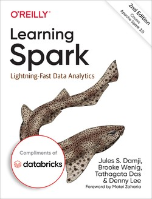

# Learning Spark: Lightning-Fast Data Analytics
Authors: Jules S. Damji, Brooke Wenig, Tathagata Das, Denny Lee

# Ch1. Introduction to Apache Spark: A Unified Analytics Engine

# Ch2. Downloading Apache Spark and Getting Started

# Ch3. Apache Spark's Structured APIs

# Ch4. Spark SQL and DataFrames: Introduction to Built-in Data Sources

# Ch5. Spark SQL and DataFrames: Interacting with External Data Sources

# Ch6. Spark SQL and Datasets

# Ch7. Optimizing and Tuning Spark Applications

# Ch8. Structured Streaming

# Ch9. Building Reliable Data Lakes with Apache Spark

# Ch10. Machine Learning with MLlib

# Ch11. Managing, Deploying, and Scaling Machine Learning Pipelines with Apache Spark

# Ch12. Epilogue: Apache Spark 3.0